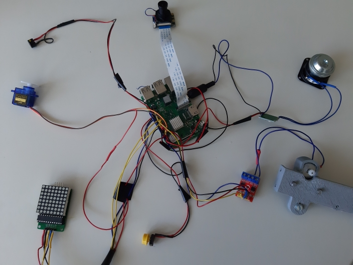

# Coolometer

A device, [inspired by Futurama](https://www.youtube.com/watch?v=tXb7gLe0zNk), to measure your coolness with a "real" AI.


## Components

This are the components we used. Alternatives might work also

- Raspberry PI Model 3 B+
- Raspberry PI Camera
- Micro Servo SG90
- MAX 4218CNG LED Matrix
- L9110 Motor Driver
- DC Motor 3V 16500 RPM 0.35A 130 Type
- Pizzo Speaker
- 3.5 mm Headphone Jack
- LY591-4 speaker
- PAM8403 Mini Amplifier
- Button
- 5V 2.1 A PowerBank for Power supply

### Wiring

Raspberry PI Model 3 B+ has enough ground Pins for all parts. Only one 5V pin has to be shared by the LED Matrix and the Servo motor.

<p align="center">

</p>

#### Micro Servo SG90
One 5V shared with MAX 4218CNG LED Matrix<br/>
Data on GPIO 17 / PIN 11

#### MAX 4218CNG LED Matrix
One 5V shared with MAX 4218CNG LED Matrix<br/>
DIN on GPIO 10 / PIN 19<br/>
CS on GPIO 8 / PIN 24<br/>
CLK on GPIO 11 / PIN 23

#### L9110 Motor Driver
VCC on 3.3 <br/>
IA1 on GPIO 26 / PIN 37<br/>
IB1 on GPIO 20 / PIN 38

#### Pizzo Speaker
VCC on 3.3<br/>
GND on GPIO 36 / PIN 16

#### Headphone Jack / Amplifier
The Headphone Jack uses the Audio Out from the Raspberry PI.<br/>
Solder the longest PIN of the Jack to the "I" PIN of the Amplifier Board
Solder the second longest PIN longest PIN of the Jack to the "R" PIN of the Amplifier Board. We only use one Channel here.

Solder the R OUT PINs the the speaker.

Use one 5V Pin from the Raspberry PI to power the Amplifier Board

#### Button
VCC on 3.3 <br/>
GND to GPIO 18 / PIN 12

#### Camera
The camera is connected on the Raspberry Camera slot.


## Install
Set up a Raspberry PI with [Raspberry Pi OS Lite](https://www.raspberrypi.org/software/operating-systems/) 
[Enable SSH](https://www.raspberrypi.org/documentation/remote-access/ssh/) and connect via SSH to the Raspberry
Update System ( sudo apt full-upgrade)
Run sudo raspi-config:
- ADVANCED -> Resize File System
- SYSTEM  -> AUDIO -> Headphone Jack
- Interface -> Camera -> ON
- Interface -> SPI -> ON

Set System volume with 
```bash
sudo amixer -q -M sset Headphone 100%
```
Install depenendices:
```bash
sudo apt-get install python3-pip python3-venv python3-pygame 
libfreetype6-dev libjpeg-dev libopenjp2-7 libtiff5 libjpeg-dev libtiff5-dev libjasper-dev 
libpng12-dev libavcodec-dev libavformat-dev libswscale-dev 
libv4l-dev libxvidcore-dev libx264-dev qt4-dev-tools libatlas-base-dev 
libilmbase-dev libopenexr-dev libgstreamer1.0-dev libgirepository1.0-dev libcairo2-dev
```

Install Python dependencies:
```bash
python3 -m pip install --user --upgrade pip
python3 -m pip install --user virtualenv
python3 -m venv env
source env/bin/activate
pip3 install https://dl.google.com/coral/python/tflite_runtime-2.1.0.post1-cp37-cp37m-linux_armv7l.whl
pip install -r requirements.txt
```

Create Autostart:
```bash
sudo nano /etc/rc.local 
```
add:
```bash
sudo sh /home/pi/CoolOMeter/run.sh &
```

Now Reboot the system. When booting is finished, you will hear 2 short noises from the speaker.
You Coolometer should now work.

## 3D Print and Lasercut files
The Files are Available in the CAD-Zeichnungen folder.

## Usage

After you power your raspberry, it can take about 40 seconds to boot.
When the device is ready, the pizzo will make noise for a short time and the clockhand will go to zero.

Now press the button.

The clockhand will go to 50%  and the camera starts to search for a human face.

If the face is detected the clockhand will go to your coolness value and the pizzo will make noise according to the coolness.
If your coolness is 90% or higher, the thumb will come out and you will hear an "OH Yeah"

If your press the button again you will start from the beginning. 

HAVE FUN :)

## Train your own tensorflow lite model

The files contains our trained tensorflow lite model. The train data are our little secret. If you are not happy with it, here is a short description how to make your own model.

On your host machine with Linux, Python3 and pip:
```bash
pip3 install tensorflow
pip3 install tensorflow-hub[make_image_classifier]
```

Create a folder structure like the following one. And put picture into the cool / lame folder. Only JPG Files are allowed.
Base Folder
* coolometer (Folder)
    * cool (Folder)
        * img.jpg ...
    * lame (Folder)
        * img.jpg ..
* model (Folder)


In the Base folder call this command:
```bash
make_image_classifier   
--image_dir coolometer   
--tfhub_module https://tfhub.dev/google/tf2-preview/mobilenet_v2/feature_vector/4 
--image_size 224 
--saved_model_dir model/coolModel 
--batch_size 20  
--labels_output_file class_labels.txt 
--tflite_output_file tf_model_file.tflite
```
You can use other models if you exchange the tfhub_module link to something else from the [tensorflow hub ](https://tfhub.dev/). Make sure you adjuste the image_size to your choosen model.<br/>
In your base folder should now be a class_labels.txt and a tf_model_file.tflite file. Copy this to your Raspberry into the Coolometer folder.

If you have a new model, make sure to share it with us by open a pull request with your model data.


## Credits

Big thanks to the futurama creators comming up with this great Idea.
The OhYeah sound is from here: https://www.youtube.com/watch?v=c4c-egnkdLI